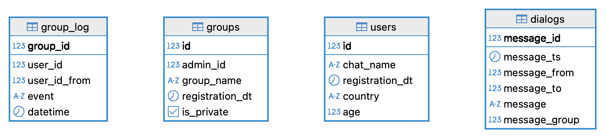
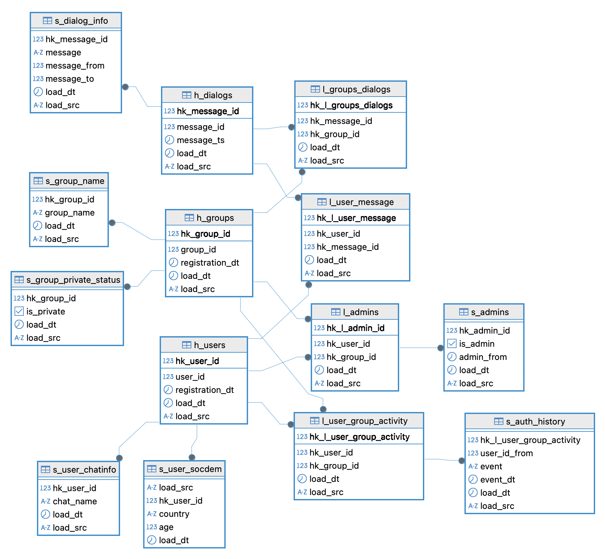
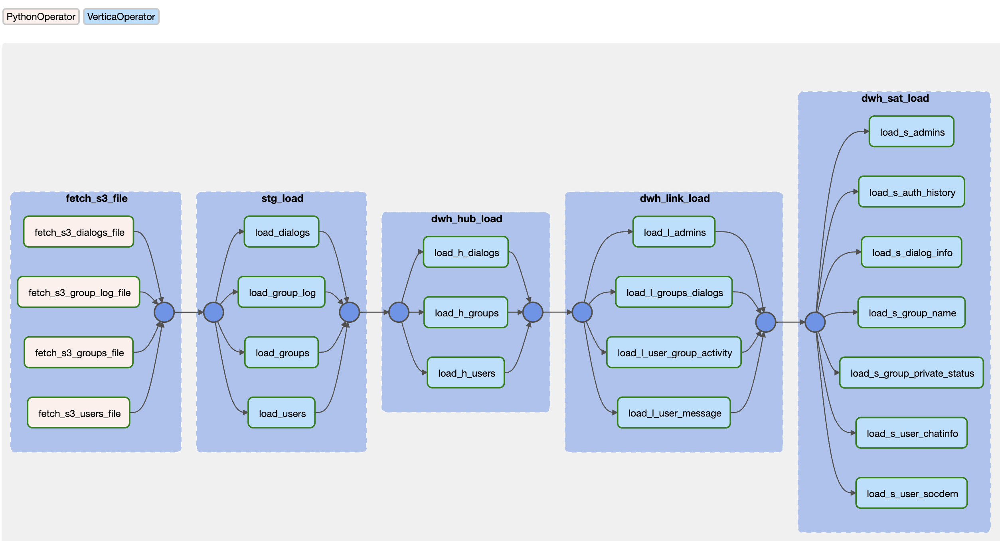

# DWH для социальной сети

`vertica` `airflow` `docker` `data vault` `s3`

---

**Описание хранилища**

Для социальной сети необходимо спроектировать аналитическую БД на базе Vertica в методологии Data Vault, собрав и преобразовав данные из облачного объектного хранилища S3, а также ответить на вопрос бизнеса с помощью sql-запроса

Хранилище состоит из минимально необходимых для решения данной задачи двух слоёв:
* STG (Staging) представляет собой хранение данных as is для источника S3



* DDS (Detail Data Storage) — ядро хранилища в модели Data Vault, ссылочная целостность поддерживается



Оркестрация загрузки данных в слои происходит с помощью Airflow (даг `dags/dwh_main_dag.py`). Слой STG загружается с помощью PythonOperator - функции `fetch_s3_file()`, DDS загружается VerticaOperator - sql-скриптами из папки `src/ddl_scripts`. DDL всех таблиц находится в файле `src/ddl_scripts/ddl.sql`



---

**Структура репозитория**

```
├── README.md
├── dags
│   └── dwh_main_dag.py
├── docker-compose.yaml
└── src
    ├── ddl_scripts
    │   ├── ddl.sql
    │   ├── h_dialogs.sql
    │   ├── h_groups.sql
    │   ├── h_users.sql
    │   ├── l_admins.sql
    │   ├── l_groups_dialogs.sql
    │   ├── l_user_group_activity.sql
    │   ├── l_user_message.sql
    │   ├── s_admins.sql
    │   ├── s_auth_history.sql
    │   ├── s_dialog_info.sql
    │   ├── s_group_name.sql
    │   ├── s_group_private_status.sql
    │   ├── s_user_chatinfo.sql
    │   ├── s_user_socdem.sql
    │   ├── stg_load.sql
    │   └── top10_old_group_conversion.sql
    └── images
        ├── dds.png
        ├── graph.png
        └── stg.png
```
